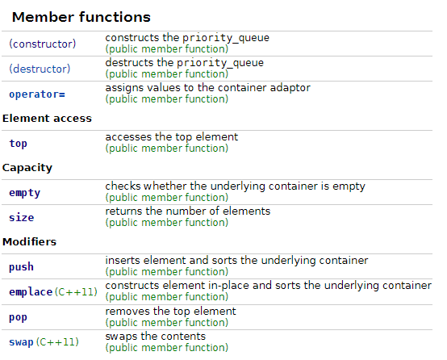

本文将介绍C++ STL 库`queue`头文件中的优先队列priority queue，主要涉及基础函数，其底层实现，以及有关应用。

<br/>

主要参考文档 https://en.cppreference.com/w/cpp/container/priority_queue

----

# [声明与初始化](https://en.cppreference.com/w/cpp/container/priority_queue/priority_queue)

``` cpp
template<
    class T,
    class Container = std::vector<T>,
    class Compare = std::less<typename Container::value_type>
> class priority_queue;
```

+ <font color = green>声明输入 `T` </font>: 指定该优先队列内存放的元素之类型 
+ <font color = green>声明输入 `Container`</font>: 指定该优先队列的底层容器
    + 注：该容器必须为支持`front(), push_back(), pop_back()`的有序容器，原因见后文源码，默认为`std::vector`
+ <font color = green>声明输入 `Compare`</font>：指定优先度的判断条件
    + 函数模板 `bool Compare(T arg_1, T arg_2);`
    + 注：当该函数返回`True`时，`arg1`将晚于`arg2`出队，即`arg2`优先度更高。换种说法，**<font color = red>在队首的元素与其他所有元素进行`compare`的结果都是`False`</font>**。
    + **默认为`std::less`，即`return arg1 < arg2;`, 如此将为大顶堆**，同理`std::greater`为小顶堆。

----

# 基础函数
此处将介绍几个较为常用的，完整列表详见 https://en.cppreference.com/w/cpp/container/priority_queue

## 构造函数

1. 默认构造函数
```cpp
priority_queue() : priority_queue(Compare(), Container()) { }
```

2. 拷贝优先队列构造函数
```cpp
priority_queue( const priority_queue& other );
```

3. 拷贝其他容器构造函数
```cpp
template< class InputIt >
priority_queue( InputIt first, InputIt last,
                const Compare& compare, const Container& cont );
```

## 容器属性函数
几乎所有C++容器都带有的常见函数，不多赘述

```cpp
bool        empty() const;      // 检查是否为空
size_type   size()  const;      // 返回容器内元素数量
```

## 队列专属函数

1. [获取队首元素](https://en.cppreference.com/w/cpp/container/priority_queue/top)（对于优先队列即为优先度最高元素）
   
``` cpp
   const_reference top() const;
```

2. [移除队首元素](https://en.cppreference.com/w/cpp/container/priority_queue/pop)
   
``` cpp
   void pop();
```

3. [元素入列](https://en.cppreference.com/w/cpp/container/priority_queue/push)
   
``` cpp
    void push( const value_type& value );
```

## 具体成员函数列表....
<div align=center></div>

----
# 代码案例

## 基础初始化，`push()`,`pop()`操作

```cpp
#include<queue>
#include<iostream>

// Print all element in the queue in order
void printQueue(std::priority_queue<int>& q){
    while(!q.empty()){
        std::cout << q.top() << ' ';
        q.pop();
    }
    std::cout << std::endl;
}

int main(int argc, char const *argv[])
{

    // Initialize the queue
    std::vector<int> val = {1, 5, 3, -10, 0};
    std::priority_queue<int> max_top_queue(val.begin(), val.end());
#if 0
    // Equivalent to:
    std::priority_queue<int, std::vector<int>, std::less<int>> 
        max_top_queue(val.begin(), val.end());
#endif

    // Try push() and top()
    std::cout << max_top_queue.top() << std::endl;      // 5
    max_top_queue.push(100);    
    std::cout << max_top_queue.top() << std::endl;      // 100

    // Try pop()
    printQueue(max_top_queue);                          // 100 5 3 1 0 -10
    return 0;
}
```

## 自定义比较函数: 小顶堆
```cpp
#include<queue>
#include<iostream>
int main(int argc, char const *argv[]){
    std::vector<int> val = {1, 5, 100, 3, -10, 0};

    // Use greater as compare function
    std::priority_queue<int, std::vector<int>, std::greater<int>>
        min_top_queue(val.begin(), val.end());

    // Print all
    while(!min_top_queue.empty()){
        std::cout << min_top_queue.top() << ' ';
        min_top_queue.pop();
    }
    std::cout << std::endl;     // -10 0 1 3 5 100
}
```

## 自定义比较函数: 使用`lambda`

希望实现：对于上文的`val`，获得其`index`的排序，排序规则为`val[index]`的大小

```cpp
#include<queue>
#include<iostream>
#include <functional>

int main(int argc, char const *argv[]){
    std::vector<int> val = {1, 5, 100, 3, -10, 0};
    std::vector<int> ind = {0, 1, 2, 3, 4, 5};

    // Self-design compare function
    // Use a priority queue to get the order of val, in index
    std::function<bool (int, int)> cmp = 
        [&val](int v_1, int v_2){return val[v_1] < val[v_2]; };
    
    std::priority_queue<int, std::vector<int>, decltype(cmp)> 
        max_ind_queue(ind.begin(), ind.end(), cmp);
    
    // Print all
    while(!max_ind_queue.empty()){
        std::cout << max_ind_queue.top() << ' ';
        max_ind_queue.pop();
    }
    std::cout << std::endl;     // 2 1 3 0 5 4
}
```

----
# 底层实现

本节将介绍常用函数的底层实现，其中部分函数（如构造函数，`push()`，等）存在使用`std::move()`的实现，逻辑类似，在此不多赘述。

<br/>

`priority queue`的底层是由[heap](https://www.cplusplus.com/reference/algorithm/make_heap/)实现的（`heap`的详细内容将在后续更新），并将容器与比较函数作为`protected`的成员变量

```cpp
protected:
    _Container c{};
    _Pr comp{};
```

## 构造函数

初始化容器及比较函数成员变量，并直接调用`make_heap`使得系统将该容器标记为`heap` 

简单来说，此处的操作 **<font color=red>将`heap`的首尾标记为容器当前的首尾，`heap`将搜寻该范围内的最高优先对象。后续每次对容器的操作如`push_heap(),pop_heap()`都需要调用`heap`相关函数，将`heap`的首尾及最高优先级元素进行更新</font>**

```cpp
priority_queue(const _Pr& _Pred, const _Container& _Cont) : c(_Cont), comp(_Pred) {
    _STD make_heap(c.begin(), c.end(), comp);
}
```

其余重载构造函数逻辑类似，只不过改变了初始化容器或比较函数的操作

## top()

直接返回容器中的首个元素，该操作的原因是 **`heap`操作会将最高优先度的元素置于容器的首位**

```cpp
_NODISCARD const_reference top() const noexcept(noexcept(c.front())) /* strengthened */ {
    return c.front();
}
```
<font color=green>时间复杂度：$O(1)$</font>


## push(const value_type& Val)

将新的元素使用`push_back()`加入到容器尾部，并调用`push_heap`。**该操作扩展当前`heap`的尾为当前容器的尾（也就是将新的元素纳入`heap`的管理范围），接着将容器的首更新为优先度最大的值**

```cpp
void push(const value_type& _Val) {
    c.push_back(_Val);
    _STD push_heap(c.begin(), c.end(), comp);
}

// 使用std::move()，直接将传入的右值引用，Val，的内容送入容器且不产生拷贝
// 操作结束后Val将变为non-specified
void push(value_type&& _Val) {
    c.push_back(_STD move(_Val));
    _STD push_heap(c.begin(), c.end(), comp);
}
```

<font color=green>时间复杂度：通常为$O(log(n))$</font>，主要为`push_heap()`($O(log(n))$)与`push_back()`的开销

## pop()

与`push`同理，但是操作顺序有所不同，**首先调用`pop_heap()`将容器的首元素（最高优先度元素）置于容器的末尾，随后将第二优先元素置于首位，并更新`heap`的尾至容器的尾之前一位（也就是将原先的`top()`元素排除管理）**。

如上操作后，**<font color=red>原容器的首为第二优先度元素，容器的尾为最高优先度元素</font>**，此时调用`pop_back()`即可将最高优先度元素删去。


```cpp
void pop() {
    _STD pop_heap(c.begin(), c.end(), comp);
    c.pop_back();
}
```

<font color=green>时间复杂度：通常为$O(log(n))$</font>，主要为`pop_heap()`($O(log(n))$)与`pop_back()`的开销

----

# LeetCode 实战
 
[No. 11. 盛最多水的容器 Container With Most Water](https://zhuanlan.zhihu.com/p/493433048)
[No. 703. 数据流中的第 K 大元素 Kth Largest Element in a Stream](https://leetcode-cn.com/problems/kth-largest-element-in-a-stream/)     
[No. 1046. 最后一块石头的重量 Last Stone Weight](https://zhuanlan.zhihu.com/p/495372197)


其中No.703便暴露了`priority_queue`不方便直观遍历的缺点


----

# 总结

## 优点
`priority_queue`作为对`heap`的封装，在不增加复杂度的情况下免去了许多`heap`的繁琐操作，并使使用者着重关注于最高优先度的元素。该特性使得`priority_queue`在最值问题中频繁被使用。

## 缺点
相较于底层容器掌握在程序员手中的`heap`，**`priority_queue`的底层容器无法从外部访问，这使得单纯遍历`priority_queue`变得难以直观实现。**